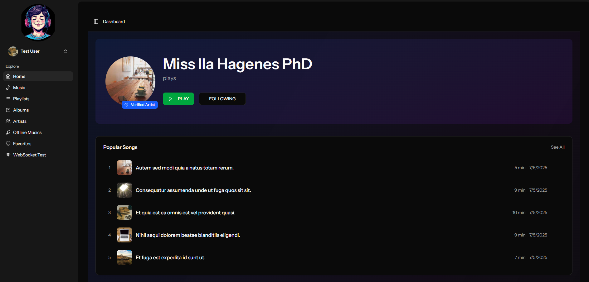
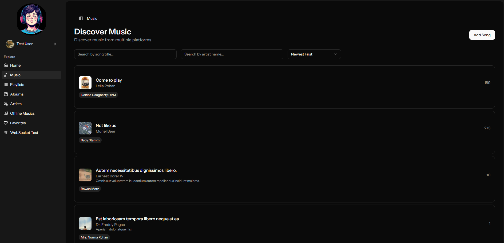
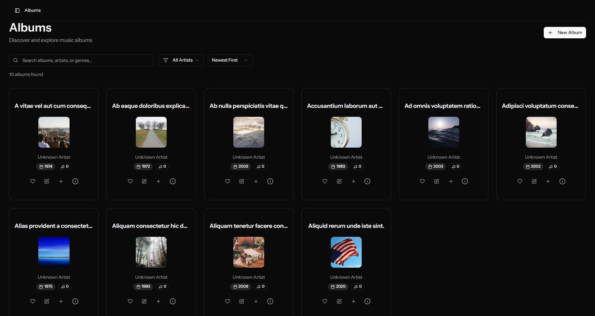
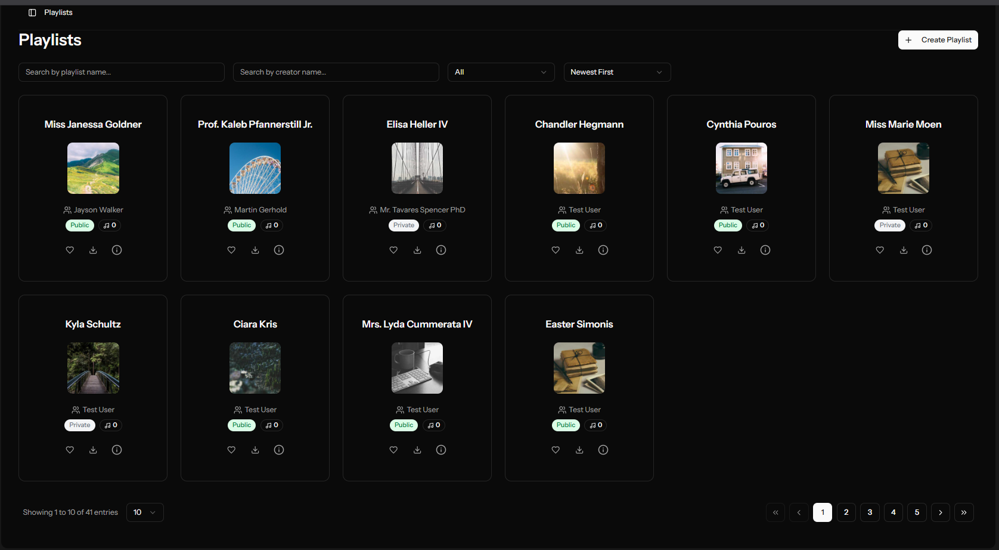

# Odisea Music App 🎵

Una aplicación moderna de streaming de música full-stack construida con Laravel y React. Odisea permite a los usuarios descubrir, reproducir y organizar música de múltiples plataformas con una interfaz hermosa y responsiva.

## 📱 Capturas de Pantalla

### Dashboard Principal



### Biblioteca Musical



### Álbumes



### Artistas


### Listas de Reproducción



## 🚀 Características

### 🎵 Gestión Musical

- **Integración Multiplataforma**: Soporte para archivos locales, YouTube y SoundCloud
- **Descubrimiento Musical**: Navega canciones, álbumes y artistas con búsqueda avanzada
- **Reproductor en Tiempo Real**: Transmite música con reproducir/pausar, control de volumen y seguimiento de progreso
- **Canciones Favoritas**: Marca canciones como favoritas para acceso fácil
- **Biblioteca Musical**: Organiza tu colección con listas de reproducción y álbumes

### 👥 Gestión de Usuarios

- **Autenticación**: Registro e inicio de sesión seguro de usuarios
- **Gestión de Perfil**: Actualiza información de perfil y preferencias
- **Listas de Reproducción de Usuario**: Crea y gestiona listas de reproducción personales
- **Características Sociales**: Comparte música y sigue a otros usuarios

### 🎨 Interfaz y Experiencia

- **UI Moderna**: Diseño limpio y responsivo con soporte para modo oscuro/claro
- **Aplicación Web Progresiva**: Optimizada tanto para escritorio como móvil
- **Actualizaciones en Tiempo Real**: Integración WebSocket para actualizaciones en vivo
- **Accesibilidad**: Construida con las mejores prácticas de accesibilidad

### 🔧 Características de Administración

- **Gestión de Contenido**: Agregar, editar y eliminar canciones, álbumes y artistas
- **Gestión de Usuarios**: Gestionar cuentas de usuario y permisos
- **Analíticas**: Rastrear interacciones musicales y engagement de usuarios

## 🏗️ Arquitectura

### Backend (Laravel)

- **Framework**: Laravel 12.x con PHP 8.2+
- **Arquitectura**: Patrón Repository con capa de Service
- **Base de Datos**: MySQL con claves primarias UUID
- **Autenticación**: Laravel Sanctum para autenticación API
- **Tiempo Real**: Laravel Reverb para conexiones WebSocket

### Frontend (React)

- **Framework**: React 19 con TypeScript
- **Enrutamiento**: Inertia.js para experiencia SPA perfecta
- **Componentes UI**: Radix UI + Tailwind CSS
- **Gestión de Estado**: React Context para estado del reproductor
- **Herramienta de Construcción**: Vite para desarrollo y construcción rápida

## 📊 Entidades de Base de Datos

### Entidades Principales

#### Usuarios

- **Campos**: id, name, email, password, avatar, timestamps
- **Relaciones**: playlists, canciones favoritas, descargas, interacciones

#### Canciones

- **Campos**: id, title, duration, cover_url, platform_id, artist_id, album_id, added_by
- **Relaciones**: plataforma, artista, álbum, favoritos, interacciones, descargas

#### Artistas

- **Campos**: id, name, image_url, bio, timestamps
- **Relaciones**: canciones, álbumes, interacciones

#### Álbumes

- **Campos**: id, name, cover_url, year, artist_id, owner_id
- **Relaciones**: canciones, artista, propietario, interacciones

#### Listas de Reproducción

- **Campos**: id, name, user_id, is_public, cover_image
- **Relaciones**: creador, canciones, interacciones

#### Plataformas

- **Campos**: id, name, base_url, api_key, is_active
- **Relaciones**: canciones

### Entidades de Soporte

#### Interacciones

- **Propósito**: Rastrear engagement de usuarios (conteos de reproducción, calificaciones)
- **Tipo**: Relación polimórfica (canciones, álbumes, listas de reproducción, artistas)

#### Descargas

- **Propósito**: Almacenar archivos de música descargados
- **Campos**: id, song_id, user_id, file_path, file_size

#### Favoritos

- **Propósito**: Canciones favoritas del usuario
- **Tipo**: Relación muchos-a-muchos entre usuarios y canciones

#### Géneros y GénerosCanciones

- **Propósito**: Clasificación de géneros musicales
- **Tipo**: Relación muchos-a-muchos entre canciones y géneros

## 🛠️ Endpoints de API

### Autenticación

- `POST /api/auth/login` - Inicio de sesión de usuario
- `POST /api/auth/register` - Registro de usuario
- `GET /api/user` - Obtener usuario autenticado

### Gestión Musical

- `GET /api/songs` - Listar canciones con paginación
- `POST /api/songs` - Crear nueva canción
- `GET /api/songs/{id}` - Obtener detalles de canción
- `PUT /api/songs/{id}` - Actualizar canción
- `DELETE /api/songs/{id}` - Eliminar canción
- `GET /api/songs/search` - Buscar canciones

### Listas de Reproducción

- `GET /api/playlists` - Listar listas de reproducción
- `POST /api/playlists` - Crear lista de reproducción
- `GET /api/playlists/{id}` - Obtener detalles de lista de reproducción
- `PUT /api/playlists/{id}` - Actualizar lista de reproducción
- `POST /api/playlists/{id}/songs/{song}` - Agregar canción a lista de reproducción

### Álbumes

- `GET /api/albums` - Listar álbumes
- `POST /api/albums` - Crear álbum
- `GET /api/albums/{id}` - Obtener detalles de álbum
- `POST /api/albums/{id}/songs` - Agregar canción a álbum
- `DELETE /api/albums/{id}/songs/{song}` - Remover canción de álbum

### Artistas

- `GET /api/artists` - Listar artistas
- `GET /api/artists/{id}` - Obtener detalles de artista

### Favoritos

- `POST /api/favorite-songs/toggle` - Alternar canción favorita
- `GET /api/users/{id}/favorite-songs` - Obtener favoritos del usuario

### Características en Tiempo Real

- `POST /api/websocket/emit-test` - Emitir evento de prueba
- `GET /api/websocket/connection-info` - Obtener información de conexión
- `POST /api/websocket/broadcast` - Transmitir mensaje

## 🎯 Desglose de Características Clave

### Reproductor de Música

- **Componente**: `PlayerContext` + `PlayerBar`
- **Características**:
  - Funcionalidad de reproducir/pausar
  - Control de volumen con silencio
  - Seguimiento de progreso y búsqueda
  - Soporte multiplataforma (local, YouTube, SoundCloud)
  - Gestión de cola

### Gestión de Archivos

- **Subida**: Soporte para archivos de audio e imágenes de portada
- **Almacenamiento**: Sistema de archivos local con estructura de directorios organizada
- **Formatos**: MP3, WAV, FLAC y otros formatos de audio comunes

### Búsqueda y Descubrimiento

- **Búsqueda en Tiempo Real**: Búsqueda instantánea en canciones, artistas y álbumes
- **Filtros**: Filtrar por género, año, plataforma y más
- **Ordenamiento**: Múltiples opciones de ordenamiento (nombre, fecha, popularidad)

### Diseño Responsivo

- **Mobile-first**: Optimizado para todos los tamaños de pantalla
- **Amigable al tacto**: Navegación fácil en dispositivos móviles
- **Mejora progresiva**: Funciona con o sin JavaScript

## 🚀 Primeros Pasos

### Prerrequisitos

- PHP 8.2+
- Node.js 18+
- MySQL 8.0+
- Composer

### Instalación

1. **Clonar el repositorio**

   ```bash
   git clone https://github.com/odiseo153/Odisea.git
   cd odisea
   ```
2. **Instalar dependencias PHP**

   ```bash
   composer install
   ```
3. **Instalar dependencias Node.js**

   ```bash
   npm install
   ```
4. **Configuración del entorno**

   ```bash
   cp .env.example .env
   php artisan key:generate
   ```
5. **Configuración de base de datos**

   ```bash
   php artisan migrate
   php artisan db:seed
   ```
6. **Iniciar servidores de desarrollo**

   ```bash
   composer run dev
   ```

Este comando iniciará:

- Servidor de desarrollo Laravel (puerto 8000)
- Worker de cola
- Servidor dev de Vite (puerto 5173)

### Despliegue en Producción

1. **Construir assets**

   ```bash
   npm run build
   ```
2. **Optimizar Laravel**

   ```bash
   php artisan optimize
   php artisan config:cache
   php artisan route:cache
   ```
3. **Configurar worker de cola**

   ```bash
   php artisan queue:work
   ```
4. **Iniciar servidor WebSocket**

   ```bash
   php artisan reverb:start
   ```

## 🧪 Pruebas

### Pruebas Backend

```bash
php artisan test
```

### Pruebas Frontend

```bash
npm run test
```

### Calidad de Código

```bash
# Estilo de Código PHP
./vendor/bin/pint

# Verificaciones TypeScript
npm run types

# ESLint
npm run lint
```

## 📁 Estructura del Proyecto

```
odisea/
├── app/
│   ├── Http/Controllers/       # Controladores API y Web
│   ├── Models/                 # Modelos Eloquent
│   ├── Services/               # Lógica de Negocio
│   ├── Repositories/           # Capa de Acceso a Datos
│   └── Traits/                 # Funcionalidad Compartida
├── database/
│   ├── migrations/             # Migraciones de Base de Datos
│   ├── seeders/                # Seeders de Base de Datos
│   └── factories/              # Factories de Modelos
├── resources/
│   ├── js/
│   │   ├── components/         # Componentes React
│   │   ├── pages/              # Páginas Inertia
│   │   ├── layouts/            # Componentes de Layout
│   │   ├── contexts/           # Contextos React
│   │   └── services/           # Servicios API
│   └── css/                    # Hojas de Estilo
├── routes/
│   ├── web.php                 # Rutas Web
│   ├── api.php                 # Rutas API
│   └── auth.php                # Rutas de Autenticación
├── images/                     # Capturas de Pantalla
└── public/                     # Assets Públicos
```

## 🔧 Configuración

### Variables de Entorno

```env
# Base de Datos
DB_CONNECTION=mysql
DB_HOST=127.0.0.1
DB_PORT=3306
DB_DATABASE=odisea
DB_USERNAME=root
DB_PASSWORD=

# Broadcasting
BROADCAST_DRIVER=reverb
REVERB_APP_ID=tu-app-id
REVERB_APP_KEY=tu-app-key
REVERB_APP_SECRET=tu-app-secret

# Almacenamiento de Archivos
FILESYSTEM_DISK=local
```

### Configuración de Broadcasting

- **Driver**: Laravel Reverb
- **Canales**: Canales privados de usuario, canales públicos de música
- **Eventos**: Actualizaciones de música en tiempo real, interacciones de usuario

## 🎨 Componentes UI

### Sistema de Diseño

- **Colores**: Paleta de colores personalizada con modo oscuro/claro
- **Tipografía**: Jerarquía de fuentes consistente
- **Espaciado**: Sistema de cuadrícula base de 8px
- **Componentes**: Componentes UI reutilizables basados en Radix UI

### Componentes Clave

- **PlayerBar**: Reproductor de música global
- **MusicCard**: Componente de visualización de canciones
- **AlbumCard**: Componente de visualización de álbumes
- **PlaylistCard**: Componente de visualización de listas de reproducción
- **Modales**: Formularios de crear/editar para todas las entidades

## 📈 Rendimiento

### Optimizaciones

- **Lazy Loading**: División de código para mejor rendimiento
- **Optimización de Imágenes**: Imágenes responsivas con soporte WebP
- **Base de Datos**: Consultas optimizadas con eager loading
- **Caché**: Caché Redis para datos frecuentemente accedidos

### Monitoreo

- **Seguimiento de Errores**: Registro de errores comprensivo
- **Métricas de Rendimiento**: Tiempos de carga de página y respuesta de API
- **Analíticas de Usuario**: Rastrear engagement y comportamiento del usuario

## 🤝 Contribuir

1. Fork el repositorio
2. Crear una rama de característica (`git checkout -b feature/caracteristica-increible`)
3. Commit tus cambios (`git commit -m 'Agregar característica increíble'`)
4. Push a la rama (`git push origin feature/caracteristica-increible`)
5. Abrir un Pull Request

## 📄 Licencia

Este proyecto está licenciado bajo la Licencia MIT - ver el archivo [LICENSE](LICENSE) para detalles.

## 🙏 Agradecimientos

- Laravel por el framework backend robusto
- React por la poderosa librería frontend
- Inertia.js por la experiencia SPA perfecta
- Tailwind CSS por el estilo utility-first
- Radix UI por los componentes accesibles

---

**Construido con ❤️ por Odiseo Esmerlin Rincon Sanchez**
